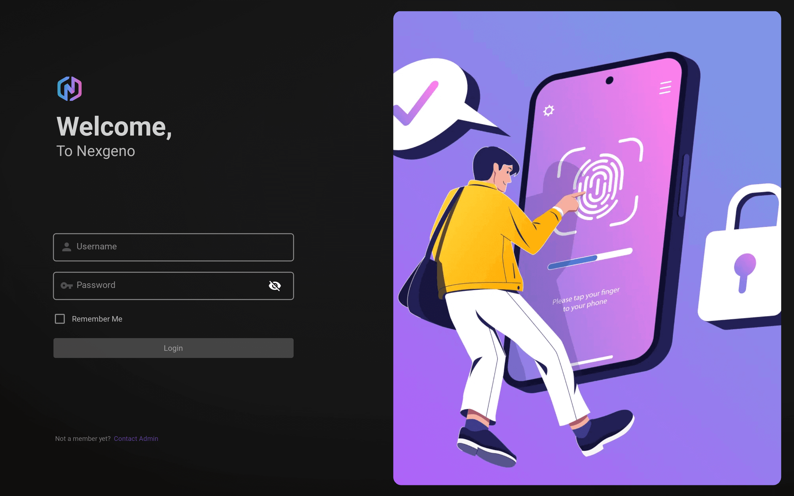
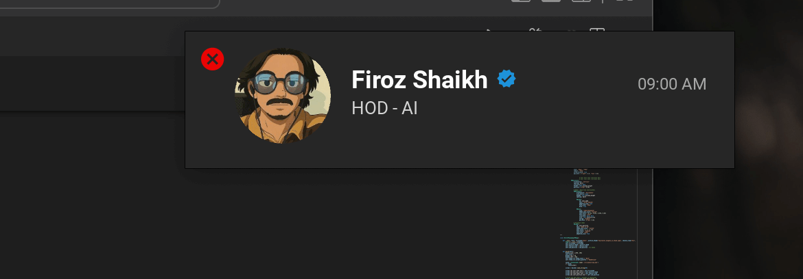

<h2 align="left" style="display: flex; align-items: center;">
    CRM Login Desktop App
</h2>

This ***Desktop application*** is designed to streamline the login process for employees accessing the **Company CRM**, making it quicker and more efficient. Additionally, it provides a smart solution for time tracking, ensuring that employees never forget to clock in, thus improving both user experience and administrative tasks.

> [!Tip] <h4>Key Features</h4>
>
> - ***Faster Login***: Achieves login times of 300-500ms, much faster than the typical
700-900ms
> - ***One-time Login***: After the first login, employees stay logged in with the
"Remember Me" option.
> - ***Auto Time Tracking***: Automatically tracks working hours with a one-click Clock In
feature
> - ***Employee Data Sync***: Fetches employee info (name, position, etc.) directly from
the CRM API.
> - ***Automatic Startup***: The app runs automatically on system boot for seamless login
and time tracking.

 

 &nbsp; &nbsp;
 &nbsp; &nbsp;
 &nbsp; &nbsp;
 &nbsp; &nbsp;
 &nbsp; &nbsp;
 &nbsp; &nbsp;
 &nbsp; &nbsp;
 &nbsp; &nbsp;

  

  

  

 

> [!IMPORTANT]
>
> ### Why I Built This
> Employees at my company frequently forgot to clock in, leading to errors in time tracking and even salary deductions.
>
> - Employees often forgot to clock in, requiring manual adjustments by admins
> - Time tracking was prone to mistakes and salary issues 
> - The login process was slow , Open chrome and login and then press clock-in  
> - Employees had to log in every time they started their system, creating extra effort
>
> This led to inefficiency, increased administrative workload, and a frustrating user experience.
>
> ---
> 
> ### How I Solved the Problem
>
> So I built CRM Login Enhancer — a desktop app that:
> - Optimizes login times to ***300-500ms***, making it faster and more efficient
> - Remembers login credentials for seamless access after the first login
> - Runs automatically at system startup, ensuring users are always ready to clock in  
> - Syncs employee data (name, position, etc.) directly from the company’s CRM AP
>
> It's designed for both tech-savvy employees and non-technical users — providing an easy-to-use interface that speeds up login, reduces administrative tasks, and ensures accurate time tracking for everyone

 

##  How It Works: Step-by-Step User Guide

1. **Launch the App**  
   - Upon starting the app, it will automatically run in the background on system boot.
   - You will see a login window prompting you to enter your Username and Password.
   - The login process may take 300-500ms, much faster than typical APIs.

     
   
      

2. **View the Success Window**  

   - After entering your Username and Password, click Login.
   - If your credentials are correct, you will see a success message confirming the login.

     
   
     

3. **No Need for Re-login**  
   - The next time you launch the app, your credentials will be auto-filled.
   - You will no longer need to enter your Username or Password. Simply click Clock In to start tracking your time.

     
   
     

## 5. Summary  
Watch this quick video to understand the simple workflow and how the app makes login and time tracking effortless.

https://github.com/user-attachments/assets/81b78b7e-f1e4-47d1-82a3-57739bb2562d

 

 

## 👨‍💻 Author - Contact Information

 

This project is proudly built and maintained by [@buildwithfiroz](https://github.com/buildwithfiroz) — focused on making AI tools more accessible, efficient, and developer-friendly.

If you found this useful, consider giving it a ***⭐️ on GitHub*** or contributing to improve it further!

 

---

 

<b>Made with ❤️ by Firoz</b>

